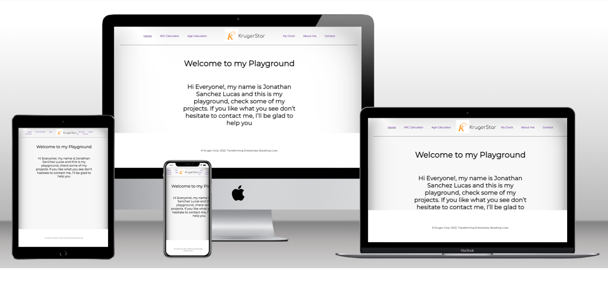

# Getting Started with my Playground App

- In this repository you can find my PlayGroundApp with all my projects

## Built With

- React JS 
- HTML
- CSS
- Git
- JavaScript
- Netlify

## Getting Started

**In this repository I will create a Playground app with React.**

## Run it

Use the following steps to run this Portfolio locally:

- open the terminal

- get in the directory you want this folder to appear

- put: git clone `git@github.com:rjonato96/kruger-playground.git`

- open the folder with a code editor (VS Code preferred)

- go to the index.html file and open it with live server

### Deployment

For a live demo please click on the following link:

https://feature-header--relaxed-medovik-f4e73f.netlify.app

## Authors

👤 **Jonathan Sanchez Lucas**

🧑‍💻 GitHub: [@jonato96](https://github.com/jonato96)
🐤 Twitter: [@jonato96](https://twitter.com/jonato96)

## 🤝 Contributing

[Juan Sotomayor](https://github.com/Juanse7793) - Tutor FrontEnd Kruger